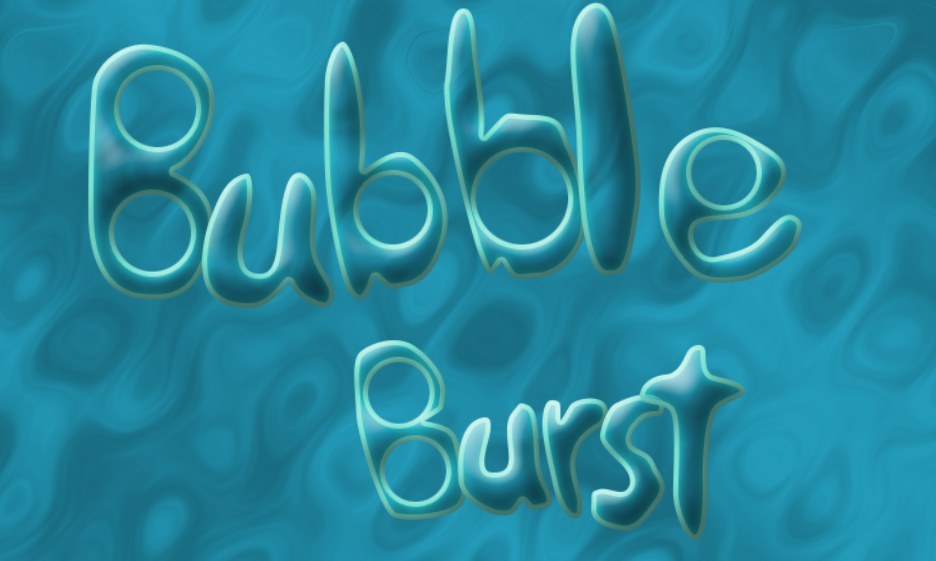

# Global Game Jam 2020
## Theme: **Bubble**

## Install
Executables are located into the directory `game/`

## Build
On Windows you need git, Visual Studio and CMake installed. Run `build_win32.bat`.
On Mac (Not tested) you need git, a compiler, CMake and possibly other dependencies (OpenGL, SDL2, etc). Install what ever cmake barfs about. Run `build_osx.sh`
On Linux (Not tested) is should work just as on Mac, but hasn't been tested in a long time.

## Credits
### Team
- Game by David (Daivuk) St-Louis
- Title Design by Chloé St-Louis
### Resources
- Bubble Pops by Abacagi -- https://freesound.org/s/497198/ -- License: Attribution 4.0
- SeqGoodVibes2 by Xcreenplay -- https://freesound.org/s/725912/ -- License: Attribution NonCommercial 4.0
- Success Resolution Video Game Fanfare Sound Effect.mp3 by FunWithSound -- https://freesound.org/s/456968/ -- License: Attribution 4.0
- success_02.wav by Kenneth_Cooney -- https://freesound.org/s/463067/ -- License: Creative Commons 0
- Error Bleep 4 by original_sound -- https://freesound.org/s/372197/ -- License: Attribution 3.0
- old cash register open and close with a bing by clubmydia+ -- https://freesound.org/s/584168/ -- License: Creative Commons 0
- Videogame Menu BUTTON CLICK by Christopherderp -- https://freesound.org/s/342200/ -- License: Creative Commons 0
- balloon movement sounds by Yuval -- https://freesound.org/s/210892/ -- License: Creative Commons 0
- metal-multi-hits.mp3 by lesaucisson -- https://freesound.org/s/585258/ -- License: Creative Commons 0
- Metal hit with dull ringouts by Artninja -- https://freesound.org/s/717721/ -- License: Attribution 4.0
- fail9.wav by Tissman -- https://freesound.org/s/457755/ -- License: Creative Commons 0
- music game, win or high score.wav by xtrgamr -- https://freesound.org/s/244536/ -- License: Attribution 4.0
### Tech
- Use OakNut engine (onut): https://github.com/Daivuk/onut
